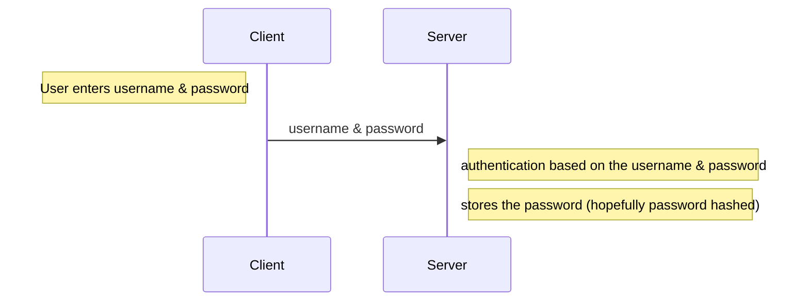
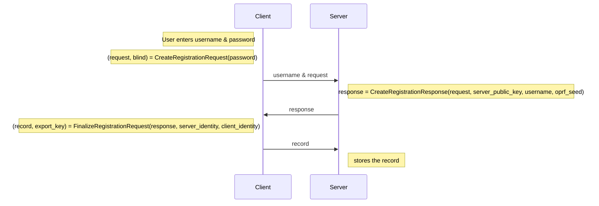
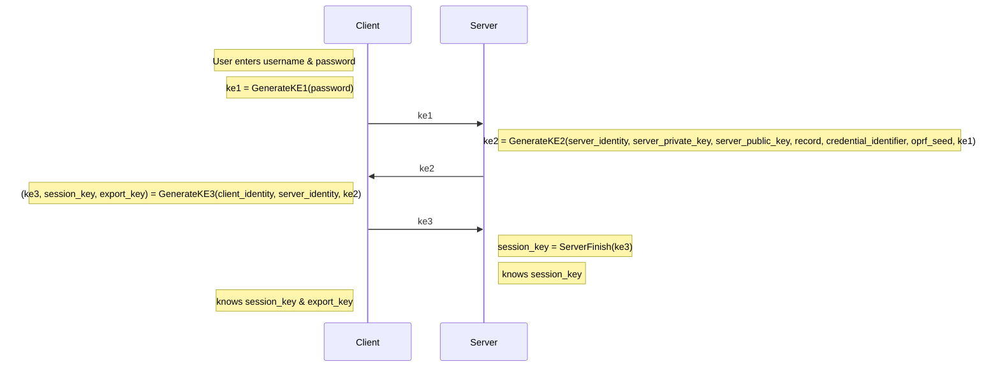

# Flow

## Ideas

- Get inspired by Debuggers where you can jump in and out of the code.
- Allow to move forward to the next step (comment for each step)
- Allow to jump out of a function (function is just giving context - is it needed? procedural might be better)
- Protocol visualizer? (inspiration https://noiseexplorer.com/)

## Protocol Registration

import { Protocol } from '../../../components/protocol/Protocol'

<Protocol />

## Protocol Login

import { ProtocolLogin } from '../../../components/protocol/ProtocolLogin'

<ProtocolLogin />

## Password based authentication

### Registration & Login



The issues with this approach is that the server receives the password in clear text.

## OPAQUE

### Registration



### Login




## Building Blocks

- OPRF
- Key Derivation Function (KDF)
- Message Authentication Code (MAC)
- Hash
- Key Stretching Function (KSF)

## Server Setup

A server generates a private/public key pair and a OPRF seed.

## Registration

```
// Client

(request, blind) = CreateRegistrationRequest(password)

// Registration request (Client -> Server)

request

// Server

response = CreateRegistrationResponse(request,
                                       server_public_key,
                                       credential_identifier,
                                       oprf_seed)

// Registration response (Server -> Client)

response

// Client

(record, export_key) = FinalizeRegistrationRequest(response,
                                                    server_identity,
                                                    client_identity)

// Record (Server -> Client)

// Server

Store the record
```

```
// Client

ke1 = GenerateKE1(password)

// Registration request (Client -> Server)

// Server

ke2 = GenerateKE2(server_identity, server_private_key,
                    server_public_key, record,
                    credential_identifier, oprf_seed, ke1)

// Registration response (Server -> Client)

// Client

(ke3,session_key,export_key) = GenerateKE3(client_identity,
                               server_identity, ke2)

// Record (Server -> Client)

// Server

session_key = ServerFinish(ke3)
```


## Authentication

```

```